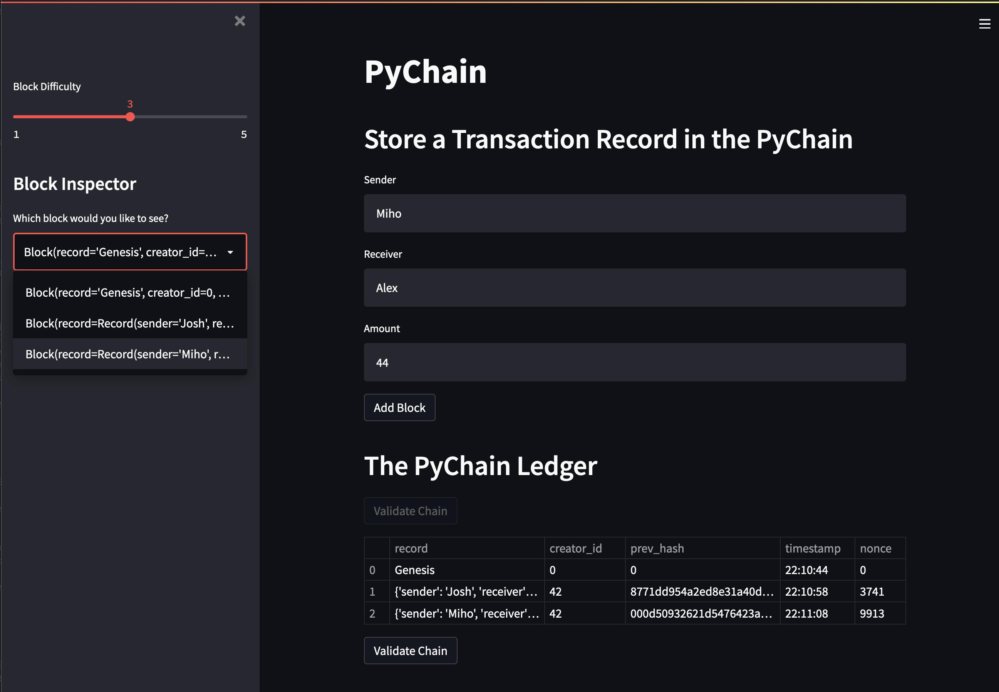
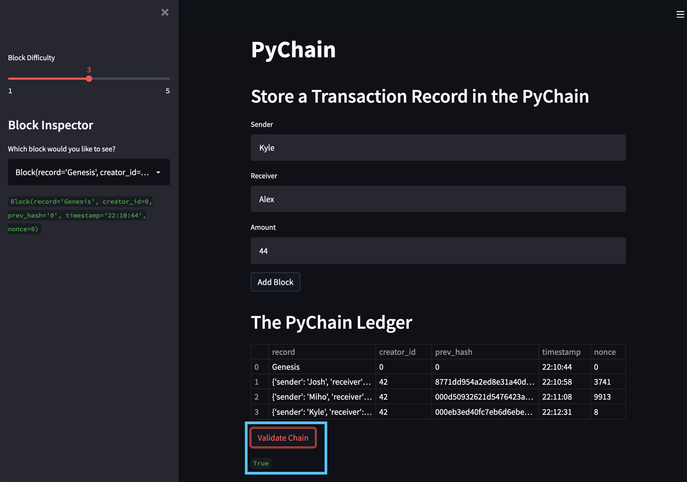

# Blockchain-Based Transaction Ledger

This project builds a blockchain to store the details of transactions; sender, receiver, amount. Streamlit is used for the frontend, allowing new transactions to be added to the blockchain by non-technical users.

<br>

## Technologies

This project leverages python 3.7 with the following packages:

* [Pandas](https://pandas.pydata.org/) - For analyzing and transforming data
* [Streamlit](https://streamlit.io/) - For rapidly building frontends for data-driven apps

<br>

## Installation Guide

Before running the application first install the following dependencies.

```python
 pip install pandas
 pip install streamlit
```

<br>

## Usage

To use the app clone the repository and run the following command in the directory where `pychain.py` is located:

```python
 streamlit run pychain.py
```

To store a transaction in the blockchain fill in the *sender*, *receiver*, and *amount* fields, then click *Add Block*.

After storing the transaction the updated blockchain will be displayed under The PyChain Ledger.



Clicking *Validate Chain* confirms the validity of the blockchain and displays the results below the button.



<br>

## Contributors

Josh Mischung: [josh@knoasis.io](josh@knoasis.io), [LinkedIn](https://www.linkedin.com/in/joshmischung/)

<br>

## License

MIT License

Copyright (c) [2022] [Joshua Mischung]

Permission is hereby granted, free of charge, to any person obtaining a copy
of this software and associated documentation files (the "Software"), to deal
in the Software without restriction, including without limitation the rights
to use, copy, modify, merge, publish, distribute, sublicense, and/or sell
copies of the Software, and to permit persons to whom the Software is
furnished to do so, subject to the following conditions:

The above copyright notice and this permission notice shall be included in all
copies or substantial portions of the Software.

THE SOFTWARE IS PROVIDED "AS IS", WITHOUT WARRANTY OF ANY KIND, EXPRESS OR
IMPLIED, INCLUDING BUT NOT LIMITED TO THE WARRANTIES OF MERCHANTABILITY,
FITNESS FOR A PARTICULAR PURPOSE AND NONINFRINGEMENT. IN NO EVENT SHALL THE
AUTHORS OR COPYRIGHT HOLDERS BE LIABLE FOR ANY CLAIM, DAMAGES OR OTHER
LIABILITY, WHETHER IN AN ACTION OF CONTRACT, TORT OR OTHERWISE, ARISING FROM,
OUT OF OR IN CONNECTION WITH THE SOFTWARE OR THE USE OR OTHER DEALINGS IN THE
SOFTWARE.
